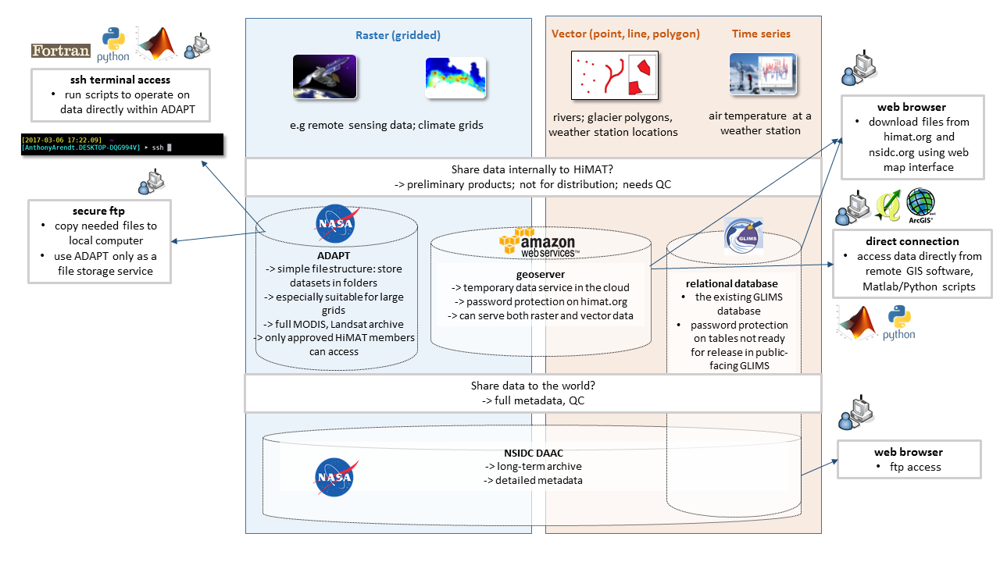

---

title: "Introduction"
teaching: 15
exercises: 0
questions:
- "What is the purpose of having a HiMAT data infrastructure?"
- "Who are the clients and what are some typical use cases?"
- "What methods are in place to ensure my data are safe?"
- "What kinds of support and services can I expect from each of the different data coordinators?"
- "How can I work to help this progress as smoothly as possible?"
objectives:
- "review different categories of data (raster, vector, time series)"
- "learn which data centers will be responsible for handling each kind of data"
- "learn best practices to ensure data transfer and access occurs smoothly across the team"
key points:
- "Where you go to store and find data during HiMAT project depends on the data type, size and usage constraints"
- "Several methods/data centers are provided and users can choose which approach works best"
- "co-location of processing/analysis with data storage is encouraged, to minimize transfer of large files" 
---

## Overview

A core feature of the HiMAT project is the construction and utilization of data sharing tools to foster efficient collaboration, reproducible research and enhanced stakeholder engagement. Several teams are funded to coordinate data infrastructure, and therefore HiMAT can expect to receive explicit assistance for data sharing tasks in ways not provided by other projects. These lessons provide information on the types of services we will make available and how they will facilitate development of high-impact scientific studies in the HMA region. 

### HiMAT data infrastructure

Why are we investing time in building a data infrastructure for this project? Aren't there enough data providers such as NSIDC, NCAR, the NASA DAAC, etc. that I already use to get my data?

There are several ways to answer these questions:
* the cross-team collaboration required by the NASA HMA project necessitates the sharing of preliminary data products which are not yet fully validated and may not be ready to share with the public. Existing data infrastructures primarily store completed datasets on public-facing servers. So there is a considerable gap in our provisioning of privately accessible, cloud-based computational tools for this kind of research.
* datasets to be generated by HiMAT are particularly voluminous, especially the high resolution Digital Elevation Models (DEMs) and resolution imagery drived from DigitalGlobe commercial satellite products. Many existing data centers are not set up to handle data of this size, and even if they are, it is unreasonable to be downloading datasets this large to our local machines. HiMAT will need cloud computing solutions for this part of the project.
* the development of a Glacier Melt Toolkit (GMELT), as required by the NASA HMA solicitation, calls for some degree of customization in our computational tools if we are to integrate our products and provide decision support to the region. There are few if any existing independent agencies that can support that need.

 

 

<!---
https://github.com/aaarendt/2016-11-29-HiMAT/blob/gh-pages/files/read_nc.ipynb
--->

